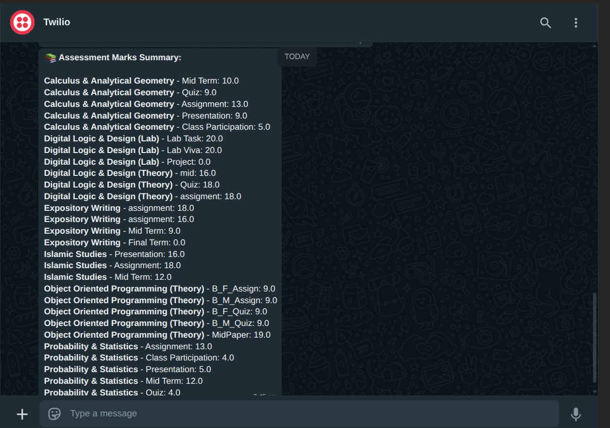

# 📳 CampusSentry – Real-Time Student Updates Notifier


> 🔔 Get notified on WhatsApp when student data is updated!

---

## 🎓 Project by Safeer Hussain

**FAST NUCES (National University of Computer and Emerging Sciences)**
Department of Computer Science
Semester: 3rd
Course: Software Engineering & Automation Practice

---

## 📘 About the Project

CampusSentry is an automation bot built to **track and notify students** about any updates in their university data (e.g., marks, attendance, schedule, etc.). This project was developed after experiencing delays in manually checking updates on the university ERP portal.

The bot scrapes a local CSV (or database), checks for changes, and **notifies the student via WhatsApp** using Twilio’s API.

---

## 🚀 Features

* 🔍 Monitors for any changes in student data
* 💬 Sends WhatsApp alerts via Twilio when a new update is found
* 🧠 Avoids sending duplicate notifications
* 📪 Clean, modular code (easy to maintain or upgrade)
* 🖥️ Flask dashboard to visualize current state

---

## ⚙️ Technologies Used

* 🐍 Python 3.x
* 📦 Flask
* 🛠️ SQLite3
* 🔁 schedule (Python scheduling library)
* 🔐 python-dotenv
* 📲 Twilio WhatsApp API
* 🧹 Custom scraping / data checking logic

---

## 📁 Project Structure

```
My_Bot/

🔹 app.py                 # Flask dashboard
🔹 notifier.py            # Twilio WhatsApp sender
🔹 scheduler.py           # Runs periodic check for updates
🔹 database.py            # SQLite operations (insert, check, etc.)
🔹 main.py                # Main logic controller
🔹 std.csv                # Sample student data (scraped or given)
🔹 templates/             # HTML templates for Flask
🔹 .env                   # Contains sensitive keys (Twilio SID, token)
🔹 .gitignore             # Prevents .env and venv from pushing
🔹 requirements.txt       # List of dependencies
```

---

## 🧪 How to Run

1. **Clone the repository**

```bash
git clone https://github.com/SyedSafeerHussain/CampusSentry.git
cd CampusSentry
```

2. **Create and activate virtual environment**

```bash
python3 -m venv venv
source venv/bin/activate
```

3. **Install dependencies**

```bash
pip install -r requirements.txt
```

4. **Add `.env` file**

```env
TWILIO_ACCOUNT_SID=your_sid_here
TWILIO_AUTH_TOKEN=your_token_here
TWILIO_PHONE=whatsapp:+14155238886
RECEIVER_PHONE=whatsapp:+923XXYYYYZZZ
```

5. **Run the bot**

```bash
python scheduler.py
```

6. **Visit dashboard**

```bash
python app.py
# Visit: http://127.0.0.1:5000
```

---

## 💬 WhatsApp Notification System

The bot uses the **Twilio Sandbox for WhatsApp** to send messages like:

```
📢 Update Detected!
Student Name: Safeer Hussain
Subject: DLD Lab
Marks Updated: 14 → 17 ✅
```

No spam. Only fresh updates 💡

---

## 🔮 Future Improvements

* Add login & authentication for dashboard
* Connect to real ERP via scraping (Selenium/Scrapy)
* Use Firebase or PostgreSQL instead of SQLite
* Telegram Bot support
* Admin panel to manage students

---

## 📄 License

This project is open-source under the MIT License.

---

> 👨‍💻 Made with 💙 by Safeer Hussain — Empowering students through automation.
